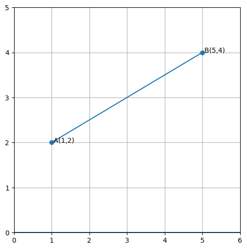

# 03.8 — Crear parametrizaciones

## Recta que pasa por un punto

Si $P=(x_0,y_0)$ y $\vec v=(a,b)$ es un vector director:

$$\vec r(t)=P+t\vec v$$

por componentes:

$$x=x_0+at, \qquad y=y_0+bt$$

## Segmento entre dos puntos

Si $A$ y $B$ son los extremos:

$$\vec r(t)=(1-t)A+tB, \qquad 0\le t\le1$$

Con $t=0$ se obtiene $A$ y con $t=1$ se obtiene $B$.

## Ejemplo visual

Al crear una parametrización siempre debes indicar tanto las ecuaciones como el intervalo de $t$.
